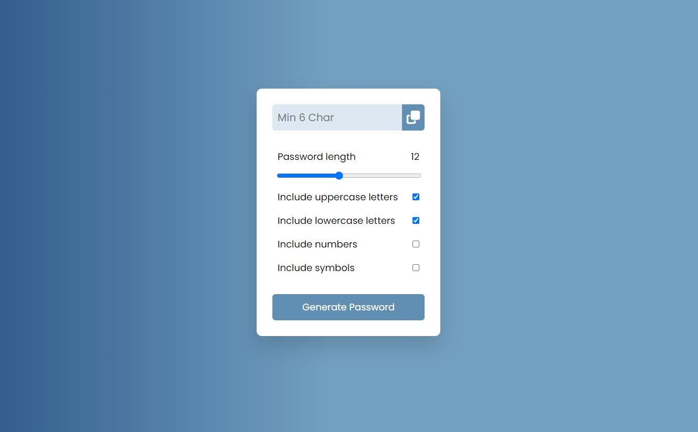

# Password Generator
> The app was created using vanilla JavaScript, HTML, and CSS and allows users 
to make password specifications and will generate random passwords based on 
the specifications.

## Table of Contents
* [General Info](#general-information)
* [Links](#links)
* [Technologies Used](#technologies-used)
* [Screenshots](#screenshots)
* [Project Status](#project-status)
* [Contact](#contact)

## General Information
This project has the following features:
- A sliders that allows users to select number of characters for the password.
- Checkboxes that allow users to specify the type of characters in the password.
- On click of the "generate password" button, a random password is generated
with the users specifications.
- On click of the clipboard button, users are able to copy the password to their
clipboard to paste it somewhere else.

## Links
- Live Demo URL: [https://marlisarebaum.github.io/password-generator/](https://marlisarebaum.github.io/password-generator/)

## Technologies Used

## Screenshots

## Project Status
Project is:  _complete_ 

## Contact
Created by [Marlisa Rebaum](https://www.linkedin.com/in/marlisarebaum/) - feel free to contact me!